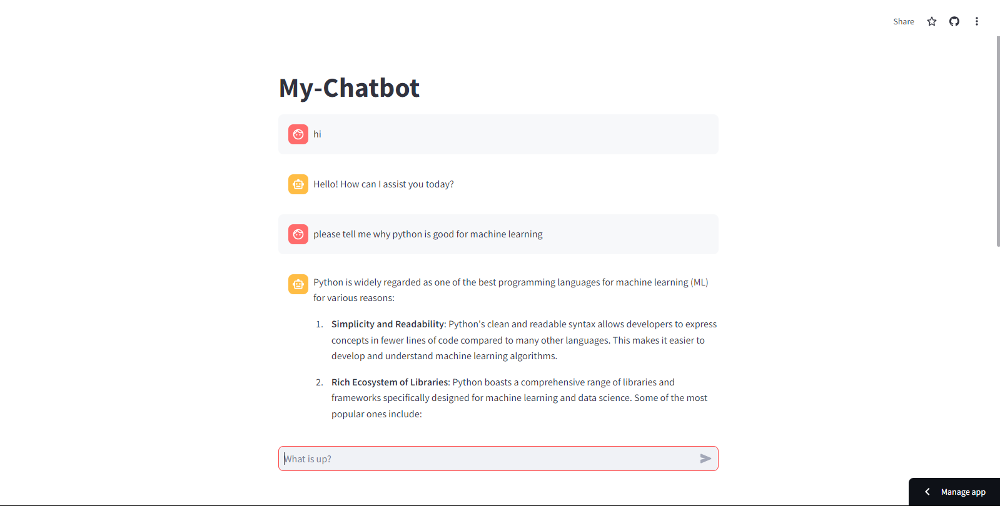

# my-chatbot

  

## Description
A basic chatbot application made with Python, streamlit, and OpenAI. 

## Table of Content
-[Description](#Description)
-[Process](#Process)
-[Links](#Links)
-[Installation](#Installation)
-[Usage](#Usage)
-[Licenses](#Licenses)
-[Contribution](#Contribution)
-[Test](#Test)
-[Acknowledgement](#Acknowledgement)
-[Questions](#Questions)

## Process
The process included installing the virtual environment and the openai and streamlit dependencies. I obtained an OpenAI API key from the website and pasted it into the .streamlit/secrets.toml file. This file is ignored by .gitignore to protect sensitive information. The main app file called chatgpt_clone.py includes all the code needed for the basic chatbot app. Streamlit and OpenAI is imported, the api key was set, and the default model is gpt-4o-mini. The code included initializing chat history, accepting user input, and displaying the chat messages in the chat message container.

## Links
Link to site: https://mackemo-chatbot.streamlit.app/

## Installation
To install this application, copy the ssh key from my github repo and clone it into your respository. Go into venv/Scripts and activate the virtual environment. Make sure openai and streamlit is installed. Run streamlit run chatgpt_clone.py.

## Usage
Made to try out simple chatbot integration with Python.

## Licenses
This repository is using the [MIT](https://opensource.org/licenses/MIT) license.

## Contribution
Contact me by email provided in Questions section.

## Test
To test this application, simply open the applcation in VScode to try it out.

## Acknowledgement
Project was done by the knowledge learned from [Streamlit](https://docs.streamlit.io/develop/tutorials/llms/build-conversational-apps).

## Questions
Contact with questions at:

Email: mackenzielmoore14@gmail.com
Click [here](https://github.com/mackemo) for Github account.